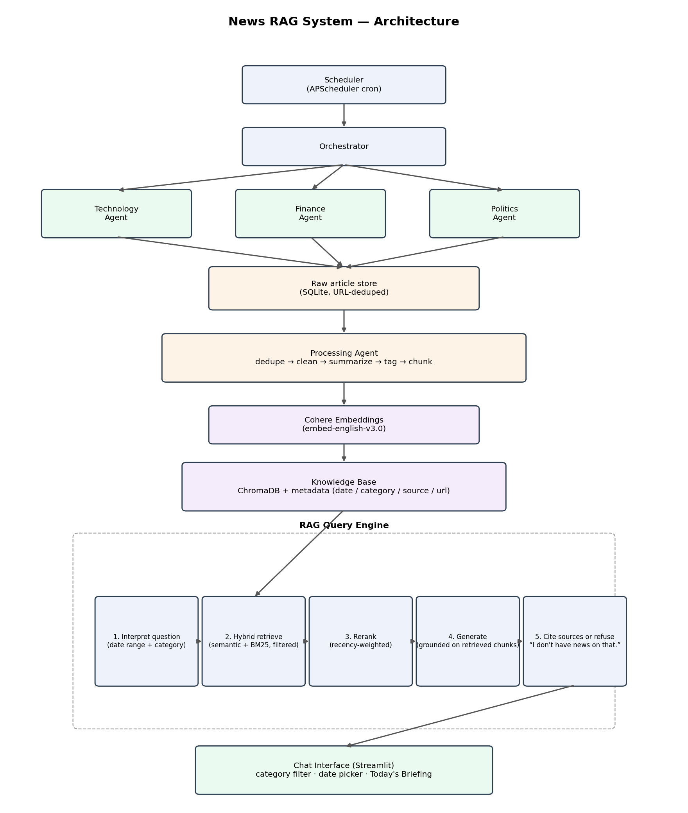

# News RAG — a multi-agent news analyst

Three fetcher agents (Technology, Finance, Politics) collect the day's news,
a processing agent cleans/dedupes/tags/chunks it, a Cohere-embedded
ChromaDB knowledge base stores it with rich metadata, and a RAG query
engine answers questions grounded only in what was actually collected —
with citations, and an honest "I don't have news on that" when it doesn't
know.



## Quick start

```bash
python -m venv .venv && source .venv/bin/activate
pip install -r requirements.txt

cp .env.example .env      # then add your COHERE_API_KEY (dashboard.cohere.com/api-keys)
set -a; source .env; set +a

# Optional: confirm the RSS/press-release URLs in sources.yaml still resolve
python -m src.cli check-sources

# Fetch -> process -> embed -> index (run this a few times over a day or two
# to build up a real corpus before the eval or demo will look interesting)
python -m src.cli run

# Optional: generate the "Today's Briefing" panel
python -m src.cli briefing

# Ask a one-off question from the terminal
python -m src.cli ask "What did the RBI announce this week and how did markets react?"

# Or launch the chat UI
streamlit run app/streamlit_app.py
```

Run the test suite (no API key or network needed — it uses a fake Cohere
client, see `tests/fakes.py`):

```bash
pip install -r requirements.txt   # includes pytest
python -m pytest tests/ -v
```

To run continuously on a schedule instead of one-off `cli run` calls:

```bash
python -m src.scheduler   # hourly fetch by default, 7am daily briefing — see src/config.py
```

## Deploying to Streamlit Community Cloud (free hosting)

This is the fully-hosted, free option: no server of your own to run. It
has one structural gap worth understanding up front, and a fix for it.

**The gap**: Streamlit Community Cloud only runs your app's web process —
there's no background cron there, so the fetch pipeline (`cli.py run`)
has nowhere to run on its own.

**The fix**: GitHub Actions has free scheduled runs, so
`.github/workflows/fetch.yml` runs the fetch pipeline on a schedule and
commits the resulting knowledge base (SQLite + ChromaDB files, in
`cloud_data/` — a directory that, unlike the default `data/`, is
deliberately *not* gitignored) back into the repo. Streamlit Community
Cloud redeploys from the repo on every push, so the app picks up whatever
the workflow just committed. It's a reasonable free-tier bridge for a
project like this; it does make the repo's git history grow over time
with binary DB file changes, and if you outgrow that, swap `cloud_data/`
for a hosted Postgres (pgvector) or managed Chroma/Qdrant instance and
drop the commit-back step from the workflow.

Steps:

1. **Push this repo to GitHub** (a new repo, public or private — Community
   Cloud supports both).
2. **In the GitHub repo settings**: Settings → Secrets and variables →
   Actions → add a repository secret named `COHERE_API_KEY` (and
   `NEWSAPI_KEY`/`GNEWS_KEY` if you use them). Then Settings → Actions →
   General → Workflow permissions → "Read and write permissions" (the
   commit-back step needs this).
3. **Trigger the workflow once manually**: Actions tab → "Fetch news and
   update knowledge base" → Run workflow. Confirm `cloud_data/` gets
   committed with real files afterward — that means the pipeline actually
   ran and found news. It'll otherwise run hourly per the `cron:` line in
   the workflow file (edit that schedule to taste).
4. **Deploy the app**: go to [share.streamlit.io](https://share.streamlit.io),
   connect your GitHub account, pick this repo, and set the main file path
   to `app/streamlit_app.py`.
5. **Add secrets in the Streamlit Cloud UI**: your app's Settings →
   Secrets, paste the same keys in TOML format (see
   `.streamlit/secrets.toml.example` for the format — never commit an
   actual `secrets.toml`, it's gitignored for that reason). Also add
   `DATA_DIR = "cloud_data"` there so the app reads the same directory the
   Action commits to, instead of the local-dev default.

One thing I want to flag rather than assert confidently: I'm not fully
certain, without checking Streamlit's current docs at deploy time, whether
Community Cloud also exposes dashboard secrets as plain OS environment
variables or only via `st.secrets` — `src/config.py` checks both
(env var first, `st.secrets` fallback) specifically so it works either
way, but worth knowing that's a defensive design choice, not a confirmed
platform behavior on my part.

## What's in the repo

```
sources.yaml              per-category feeds, official press-release pages, relevance keywords
.github/workflows/fetch.yml  optional: scheduled fetch + commit-back, for the Streamlit Cloud deployment
.streamlit/secrets.toml.example  local-testing template for the st.secrets fallback (never commit the real one)
src/
  config.py                all tunables in one place (models, chunk size, retrieval weights...)
  models.py                RawArticle / ProcessedArticle / Chunk dataclasses
  agents/base_fetcher.py   FetcherAgent: RSS + official-page + NewsAPI fetching, retries, relevance filter
  storage/raw_store.py     SQLite: URL-deduped raw articles + run log
  processing/              dedupe (near-duplicate stories) -> clean -> summarize -> tag -> chunk
  kb/embeddings.py         Cohere embed wrapper (v2 client, injectable for tests)
  kb/vector_store.py       ChromaDB wrapper: add, metadata-filtered semantic search
  rag/interpret.py         step 1: infer date range + category from the question (rule-based)
  rag/hybrid.py            step 2: semantic + BM25 fusion with a recency boost
  rag/rerank.py            step 3: Cohere rerank
  rag/generate.py          step 4-5: Cohere chat with native citations, or refusal
  rag/query_engine.py      wires steps 1-5 together
  rag/briefing.py          "Today's Briefing" generator
  orchestrator.py          runs the 3 fetcher agents -> processing agent -> indexing, with retry + run log
  scheduler.py             APScheduler cron wrapper around the orchestrator
  cli.py                   run / briefing / check-sources / ask
app/streamlit_app.py       chat UI: category filter, date range picker, Today's Briefing sidebar
eval/questions.json        30 test questions: 18 category-specific, 2 cross-domain, 4 recency-focused, 6 unanswerable (refusal test)
eval/run_eval.py           runs the questions through the live pipeline, scores, writes eval_report.md
tests/                     27 unit/integration tests against a fake Cohere client
diagrams/architecture.mmd  Mermaid source
diagrams/architecture.png  rendered diagram (diagrams/render_architecture.py)
```

## Design decisions (and why)

- **Plain Python agents, not LangGraph/CrewAI.** The brief allows either.
  A framework buys you graph visualization and built-in retry/state
  primitives; for three independent, schedule-triggered fetchers with no
  inter-agent negotiation, a plain class per agent plus a thin orchestrator
  is easier to read, test, and debug, and has zero extra dependencies. If
  you want the framework version: each `FetcherAgent.run()` call is already
  a self-contained node — wrapping it in a LangGraph graph or a CrewAI
  `Agent`/`Task` pair is a matter of registering that function, not
  rearchitecting anything.
- **Hybrid retrieval implemented as semantic (Chroma) + BM25 (rank_bm25) +
  a recency decay term**, fused by a weighted sum, then a Cohere
  cross-encoder rerank on the fused top-k. This two-stage design (cheap
  fusion over many candidates, expensive rerank over few) is standard
  practice for keeping latency and API cost down.
- **Citations use Cohere chat v2's native `documents` + `citation_options`
  support**, not "ask the model to type out a source list." The model
  returns structured citation spans tied to document IDs we control, which
  we map back to our own URL/date/source metadata — far more reliable than
  parsing free-text citations out of the answer.
- **Refusal is structural, not just a prompt instruction**: if retrieval
  (after the metadata filter, and after a no-filter retry) returns nothing,
  or every candidate scores below `MIN_RELEVANCE_SCORE` post-rerank, the
  code returns "I don't have news on that." without calling the generator
  at all (see `src/rag/generate.py::generate_answer`, which short-circuits
  on an empty chunk list). The system-prompt instruction in
  `src/rag/prompts.py` is a second line of defense on top of that, not the
  only one.
- **Query interpretation (date range / category) is rule-based**, not an
  LLM classification call — deterministic, free, and fast. It will miss
  creative phrasing; see "Extending" below for the LLM-classifier
  alternative.
- **Chunk size is measured in words, not tokens.** 300-500 tokens is
  approximated as 220-380 words (~0.75 words/token). This is called out in
  `src/processing/chunking.py` so it isn't mistaken for an exact token
  count.
- **Entity extraction and summarization are deliberately simple**
  (regex-based capitalized-phrase extraction; extractive first-N-sentences
  summary) so the pipeline runs with zero extra model calls beyond
  embedding/rerank/chat. See "Extending" for swapping in spaCy NER or an
  LLM abstractive summary.

## Accuracy notes (please read before treating this as production-ready)

- The RSS/press-release URLs in `sources.yaml` are well-known feeds as of
  my training data; I did not make a live call to confirm every single one
  resolves right now, since outlets change feed paths without notice. Run
  `python -m src.cli check-sources` after setup and replace any that fail.
- The Cohere model names in `src/config.py`
  (`embed-english-v3.0`, `rerank-english-v3.0`, `command-r-plus-08-2024`)
  were current at the time of writing but Cohere periodically retires and
  replaces model versions — check
  [docs.cohere.com/docs/models](https://docs.cohere.com/docs/models) if a
  call fails with a model-not-found error, and update the env vars
  (`COHERE_EMBED_MODEL`, `COHERE_RERANK_MODEL`, `COHERE_CHAT_MODEL`) rather
  than the code.
- The `eval/run_eval.py` "accuracy" score is an LLM-judge faithfulness
  check against the retrieved chunks — it verifies the answer doesn't
  contradict or invent claims beyond what was retrieved. It is **not** an
  independent fact-check against the real world; if an underlying news
  article was itself wrong, this won't catch that. Treat eval output as a
  first-pass automated check, not a substitute for human review.
- I have not run the eval myself against a real, populated knowledge base
  (that requires your Cohere key and a live news pull) — `eval_report.md`
  is generated by running `python -m eval.run_eval` yourself, not shipped
  with fabricated numbers.

## Extending

- **Swap in an LLM query classifier**: replace `src/rag/interpret.py`'s
  rule-based `_infer_category`/`_infer_date_range` with a small structured
  Cohere chat call (`response_format={"type": "json_object"}`), keeping the
  same `QueryInterpretation` return type so nothing downstream changes.
- **Better entities**: swap `src/processing/tagging.py`'s regex heuristic
  for spaCy's `en_core_web_sm` NER pipeline.
- **Abstractive summaries**: replace `extractive_summary` in
  `src/processing/clean.py` with a short Cohere chat call per article (adds
  one API call per article — watch cost/latency if you're pulling
  hundreds a day).
- **Swap the agent framework**: each fetcher's `run()` and the
  `ProcessingAgent.run()` are already self-contained callables with no
  shared mutable state beyond the SQLite store, so wiring them into
  LangGraph nodes or CrewAI tasks/agents is additive, not a rewrite.
- **Swap the vector DB**: `src/kb/vector_store.py` is the only file that
  talks to Chroma; a Qdrant/Pinecone/pgvector backend needs the same
  `add_chunks` / `semantic_search` / `all_chunks_in` methods.

## Deliverables checklist (per the brief)

- [x] Code repository with a README (this repo)
- [x] Architecture diagram (`diagrams/architecture.png`, `.mmd` source)
- [x] Evaluation harness with 30 test questions and scoring
      (`eval/questions.json`, `eval/run_eval.py` — generates
      `eval/eval_report.md` when run against a populated knowledge base)
- [ ] A working deployed app, or a local demo — run `streamlit run
      app/streamlit_app.py` locally; deployment (Streamlit Community Cloud,
      a VM, etc.) is an infra choice left to you
- [ ] A 10-minute demo and presentation — see `docs/demo_script.md` for a
      suggested walkthrough; the slides/recording themselves are on you
